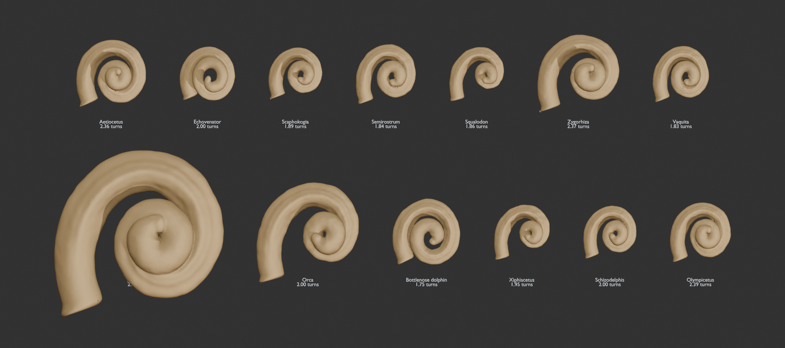

# 10k Science Cochlea Generator

A measurement-driven procedural cochlea generator for Blender, developed for
[10k Science](https://10k.science). It creates comparative cetacean cochlear
endocasts from published morphometrics and exports co-registered GLB assets for
scientific visualization, web, and VR.



> This is a comparative morphology and visualization tool. It is not a
> patient-specific, histological, or diagnostic reconstruction system.

## What it generates

- Right-sided, hollow cochlear endocast meshes with an outward-rolled inlet.
- A measurement-constrained spiral using cochlear length (`Cl`), width (`Cw`),
  height (`Ch`), basal width (`W2`), and turn count (`#T`).
- Subtle deterministic three-scale geometric displacement for organic surface
  variation; no shader normal input is required.
- A separate turn-count noodle GLB aligned to each cochlea:
  - purple `T00_100`: 0–1 turn
  - orange `T100_200`: 1–2 turns
  - green `T200_PLUS`: any remainder beyond 2 turns
- Separately addressable, single-material noodle meshes for importers that do
  not preserve per-face material assignments.

The included v0.37 release contains 13 cochlea/noodle pairs. Cochleas average
57,830 triangles and range from 52,990 to 62,320 triangles.

## Included specimens

Aetiocetus, Echovenator, Scaphokogia, Semirostrum, Squalodon, Zygorhiza,
Vaquita, Blue whale, Orca, Bottlenose dolphin, Xiphiacetus, Schizodelphis, and
the simocetid CCNHM 1000 specimen represented by the project label
“Olympicetus.”

## Ready-to-use assets

- [`assets/glb/`](assets/glb/) contains isolated cochlea and noodle GLBs.
- [`assets/cochlea_normalized_exports_v37_three_section_noodles.blend`](assets/cochlea_normalized_exports_v37_three_section_noodles.blend)
  contains the complete Blender review scene.
- [`validation/validation.json`](validation/validation.json) records a clean
  re-import validation for all 13 pairs.

Each cochlea/noodle pair shares the same local coordinates and aligns when both
files are imported. Blender source coordinates are millimetres; exported GLBs
preserve physical scale in metres.

## Requirements

- Blender 4.3 or newer; validated with Blender 5.1.2.
- No external Python packages are required. Scripts use Blender's bundled
  `bpy`, `bmesh`, and `mathutils` modules.

## Install as a Blender add-on

1. Open **Edit → Preferences → Add-ons**.
2. Select **Install from Disk**.
3. Choose [`cochlea_generator.py`](cochlea_generator.py).
4. Enable **Measurement-driven Cochlea Generator**.
5. Open the 3D Viewport sidebar and choose the **Cochlea** tab.

## Rebuild the release assets

Run these commands from the repository root. Replace the Blender executable
path as needed for your platform.

```bash
/Applications/Blender.app/Contents/MacOS/Blender \
  --background --factory-startup \
  --python tools/export_normalized_glbs.py

/Applications/Blender.app/Contents/MacOS/Blender \
  --background --factory-startup \
  --python tools/build_inner_lined_exports.py

/Applications/Blender.app/Contents/MacOS/Blender \
  --background --factory-startup \
  --python tools/validate_normalized_glbs.py -- \
  output/glb_normalized_v37_three_section_noodles_report.json \
  output/glb_normalized_v37_three_section_noodles_validation.json
```

The first command builds the normalized open-shell baseline. The second adds
the shared hollow liner, rolled inlet, physical surface displacement, and
three-range noodle packaging. The third re-imports every GLB and checks
alignment, handedness, materials, and manifold topology.

## Measurement model

The shared solver applies the same morphology rules to every specimen:

1. `#T` sets angular sweep exactly.
2. `Cl` constrains radial contraction without inventing turns.
3. `Cw` sets external major width and `Ch` sets complete external height.
4. `W2` softly informs basal planform and canal thickness.
5. Secondary measurements inform validation and shared morphology, not
   per-specimen overrides.

The generated meshes represent bony-labyrinth endocasts, not thin membranous
cochlear ducts. The public presets contain measurements and source identifiers;
they do not contain specimen-specific geometry tuning.

See [`docs/methodology.md`](docs/methodology.md) for the development history and
detailed measurement interpretation.

## Scientific basis and data provenance

Measurements are derived from the project measurement table and supplemental
data associated with Racicot et al., “Variation in whale (Cetacea) inner ear
anatomy reveals the early evolution of specialized high-frequency hearing
sensitivity,” *Journal of Anatomy* (2025),
[PMC11828743](https://pmc.ncbi.nlm.nih.gov/articles/PMC11828743/).

Original fossil and anatomical scan meshes are not redistributed in this
repository. Their MorphoSource media identifiers are retained in the presets
for provenance and independent retrieval subject to the source repository's
terms.

## Repository structure

```text
assets/       Final Blender and GLB deliverables
docs/         Preview and methodology notes
presets/      Published measurements and specimen metadata
tools/        Headless generation, post-processing, and validation scripts
validation/   v0.37 export report and re-import validation
```

## License

No software or asset license has been selected yet. Public visibility does not
itself grant reuse rights; add an explicit license before inviting external
redistribution or modification.
